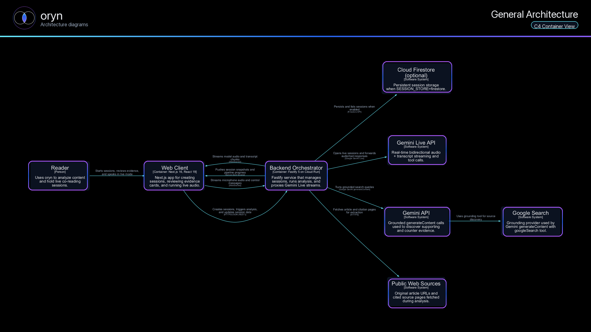
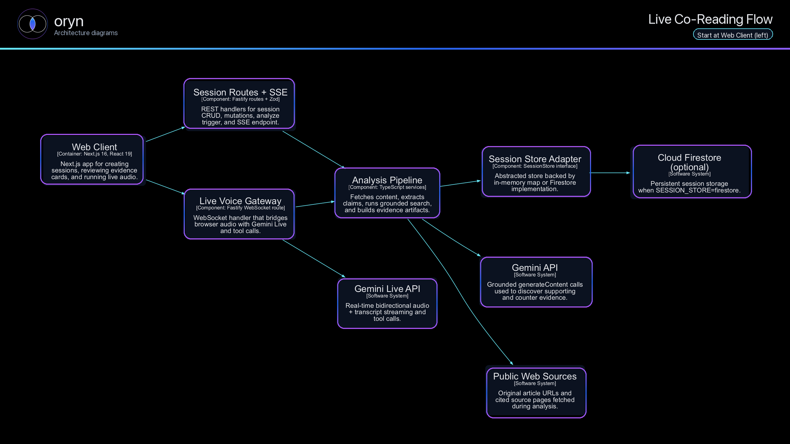

# oryn

**oryn** is an AI co-reading assistant built for the Gemini Live Agent Challenge. Paste a URL to any article, paper, or transcript — oryn reads it alongside you, surfaces evidence cards, flags disagreements, and suggests what to read next, all while you talk to it out loud in real time.

**Live demo:** https://oryn-web-s7x67kchsa-uc.a.run.app

## How it works

1. Paste any URL into the app and click **Analyze**
2. oryn fetches the content and builds evidence cards, argument clusters, and a "next reads" shortlist
3. Click **Start Live Audio** to open a voice session — speak naturally and oryn responds via Gemini Live
4. Artifacts (transcript, evidence, trace) stream to the UI as the conversation unfolds

## Hackathon compliance

| Requirement | How oryn meets it |
|---|---|
| Gemini Live API | Voice I/O powered by `@google/genai` in `apps/api` |
| Beyond text | Streaming audio in + out, live transcription over WebSocket |
| Google Cloud | Deployed to Cloud Run (`us-central1`) |

## Tech stack

- **Frontend:** Next.js, WebSocket + SSE for real-time updates
- **Backend:** Fastify, Gemini Live proxy, pipeline orchestrator
- **AI:** Gemini Live 2.5 Flash (voice), Gemini 2.0 Flash (analysis tools)
- **Cloud:** Google Cloud Run, optional Firestore session store, optional GCS caching

## Repo structure

```
apps/
  web/        Next.js UI
  api/        Fastify backend + Gemini Live proxy
packages/
  tools/      8 analysis tool modules (search, extract, classify, cluster, optimize)
  agent/      System instruction builder + epistemic contract
  shared/     Shared TypeScript types and wire protocol
docs/
  architecture.md     System overview
  demo_script.md      Demo walkthrough
  threat_model.md     Security considerations
architecture-4.md     Full architecture spec with diagrams
```

## Architecture diagrams

Generated from `structurizr/workspace.dsl` — run `npm run diagrams:export` to regenerate.

### System overview



### Live session flow



## Running locally

**Requirements:** Node.js 22+, npm, a Gemini API key ([get one free at Google AI Studio](https://aistudio.google.com/))

```bash
# 1. Install dependencies
npm install

# 2. Copy env templates
cp apps/api/.env.example apps/api/.env
cp apps/web/.env.example apps/web/.env

# 3. Start both services
GEMINI_API_KEY=your_key_here npm run dev
```

- **Web:** http://localhost:3000/app/co-reading
- **API:** http://localhost:8787

> Without `GEMINI_API_KEY`, the analysis pipeline runs with fallback data and Live voice is disabled.

```bash
npm test   # run backend tests
```

## Environment variables

### Backend (`apps/api`)

| Variable | Required | Default | Notes |
|---|---|---|---|
| `GEMINI_API_KEY` | One of the two auth options | — | Developer API key |
| `GOOGLE_GENAI_USE_VERTEXAI` + `GOOGLE_CLOUD_PROJECT` + `GOOGLE_CLOUD_LOCATION` | One of the two auth options | — | Vertex AI (recommended on Cloud Run) |
| `GEMINI_LIVE_MODEL` | No | `gemini-live-2.5-flash-preview` | |
| `GEMINI_MODEL` | No | `gemini-2.0-flash` | Used for analysis tools |
| `GEMINI_VOICE_NAME` | No | `Aoede` | |
| `CORS_ORIGIN` | No | — | Set to your web URL in production |
| `SESSION_STORE` | No | `memory` | Set to `firestore` to persist sessions |
| `FIRESTORE_SESSIONS_COLLECTION` | No | `oryn_sessions` | |
| `ORYN_GCS_ENABLE` / `ORYN_GCS_BUCKET` | No | — | GCS artifact caching |

### Web (`apps/web`)

| Variable | Required | Default |
|---|---|---|
| `NEXT_PUBLIC_API_BASE_URL` | No | `http://localhost:8787` |

## Deploying to Cloud Run

> Requires a Google Cloud project with billing enabled.

The deploy scripts handle Artifact Registry setup, Cloud Build, and service account permissions automatically. The API is configured with a `3600s` request timeout to support long-running SSE and WebSocket connections.

```bash
# Deploy API first
infra/cloudrun/deploy_api.sh YOUR_GCP_PROJECT_ID us-central1

# Then deploy web, passing your API URL
infra/cloudrun/deploy_web.sh YOUR_GCP_PROJECT_ID https://oryn-api-s7x67kchsa-uc.a.run.app us-central1

# Tear everything down
infra/cloudrun/cleanup_all.sh YOUR_GCP_PROJECT_ID us-central1
```
