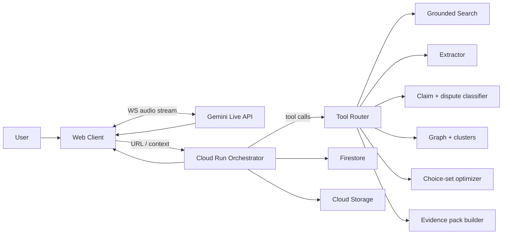
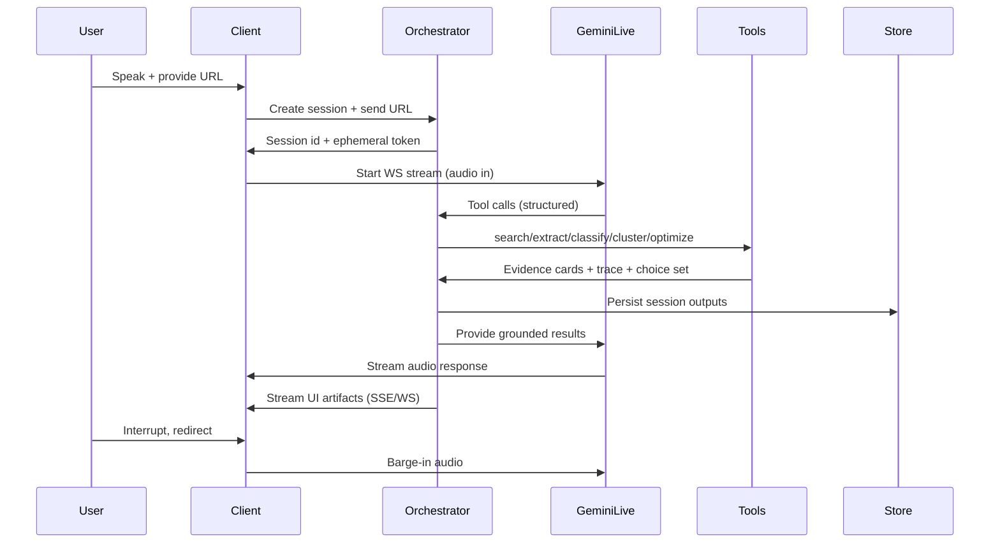

# 'oryn' Architecture

> Status: Draft  
> Hackathon: **Gemini Live Agent Challenge**  
> Category intent: **Live Agents** (default), optionally **UI Navigator** if we lean heavily on co-browsing UI  

---

## 1) Problem framing

People do not just lack information. They get stuck in:

- **Framing traps**: the same facts presented with different emphasis produce different conclusions.
- **Choice-set traps**: what you are shown next shapes what you believe is “the full picture.”
- **Confidence traps**: high confidence commentary spreads faster than careful uncertainty.

Most “break the bubble” products emphasize story aggregation and source labels. That is useful, but it does not reliably change what a user reads next, nor does it separate factual disputes from value disputes.

---

## 2) Strategy: avoid “AI slop Ground News”

### 2.1 Current landscape (what already exists)

This project must not look like a generic “paste URL, get bias score and summary.”

Common approaches already in the wild:

- **Story-level aggregation + bias labels** (example: Ground News style story pages and blindspot framing).
- **Article bias scorers** (example: bias checker tools).
- **Browser extensions** that score credibility or summarize and fact-check.
- **Claim-by-claim fact-checkers** (often positioned as “truth agents”).

### 2.2 The novelty wedge (what we do that is qualitatively different)

The core innovation is not “we cite sources.” Citations are table stakes. The wedge is:

1) **Disagreement decomposition**  
   Instead of “left vs right,” the agent decomposes disagreement into types:
   - factual dispute
   - definitional dispute
   - causal dispute
   - values tradeoff
   - prediction uncertainty

2) **Choice-set optimization (the intervention)**  
   The agent does not dump 30 links. It constructs a deliberately small “next reads” set (like 3 items) designed to:
   - maximize frame coverage
   - maximize independent corroboration
   - include at least one credible counter-frame
   - minimize redundant takes

3) **Epistemic contract (auditability)**  
   The system enforces a hard contract:
   - It will not speak a factual claim unless an evidence card exists.
   - Evidence cards must include a quote or extracted passage and a source URL.
   - All retrieval steps are visible in a trace UI.

4) **Live co-reading**  
   The agent runs while you are consuming content:
   - It listens (voice) and sees context (URL, extracted text, optional screenshots).
   - You can interrupt at any time and redirect the analysis.
   - The UI updates in real time as evidence is assembled.

### 2.3 “Not Ground News” in one line

Ground News helps you compare coverage.  
This project helps you separate disagreement types and optimize what you read next, with an auditable evidence trail.

---

## 3) Hackathon fit

### 3.1 Why this fits the Gemini Live Agent Challenge

- **Beyond text**: voice-first, live streaming interaction, optional visual context from the page being read.
- **Live**: real-time turn-taking, barge-in interruption, incremental artifact updates (evidence cards appear while you talk).
- **Agentic**: tool calls for retrieval, extraction, clustering, and choice-set building.
- **Google Cloud**: deploy backend on Cloud Run and use at least one GCP service (Firestore, Storage).
- **Gemini**: use Gemini via Google GenAI SDK or ADK, plus Live API for streaming.

### 3.2 Why judges should care (maps to scoring)

- Innovation and multimodal UX: co-reading with live disagreement mapping (not a chat window).
- Technical architecture: tool orchestration plus strict anti-hallucination contract.
- Demo and presentation: reproducible, grounded live demo with visible citations and trace.

---

## 4) User experience

### 4.1 Primary workflow: Co-reading session

1) User pastes a URL (news article, blog post, transcript) or shares a tab.
2) User asks: “What is missing here?” or “Give me the strongest counter-frame.”
3) Agent runs a pipeline live:
   - extract content
   - extract claims
   - classify dispute types
   - retrieve corroboration and counter-evidence
   - assemble evidence cards
   - output a 3-item choice set

4) User interrupts:
   - “Stop. Focus only on the factual dispute.”
   - “Show me the best steelman of the opposing argument.”

5) UI shows:
   - Disagreement map (clusters by dispute type and frame)
   - Evidence cards with quotes and citations
   - Retrieval trace (queries, constraints, why sources were chosen)
   - Choice set (3 next reads) with rationale

### 4.2 Secondary workflow: Conversation-first claim check

1) User speaks a claim they heard.
2) Agent asks 1 clarification question if needed.
3) Agent retrieves and builds evidence cards.
4) Agent returns:
   - what is known
   - what is unknown
   - what the main disagreement type is
   - next reads

---

## 5) Non-goals and constraints

### In scope
- Claim extraction and grouping
- Evidence cards with quotes and citations
- Disagreement decomposition
- Choice-set optimizer
- Live voice interaction and interruption
- Minimal, high-trust UI

### Out of scope (hackathon)
- Election persuasion or targeted political advocacy
- “Truth scoring” that claims certainty without evidence
- Social-media posting automation
- Hardware, AR/VR
- Mandatory browser extension install (optional later, but not required)

---

## 6) System architecture

### 6.1 High-level components

- **Web Client** (Next.js)
  - captures microphone audio
  - collects URL or extracted text
  - optional low-rate screenshots (only if needed)
  - renders evidence cards, map, trace, and choice set

- **Backend Orchestrator** (Cloud Run)
  - session manager
  - ephemeral token minting for Live API
  - ADK agent runtime
  - tool routing with JSON schemas
  - caching and rate limiting

- **Gemini Live API**
  - streaming audio in and audio out
  - function calling for tools

- **Tool Services** (Cloud Run or internal modules)
  - retrieval and grounding
  - article fetch and extraction
  - claim extraction and dispute classification
  - clustering
  - choice-set optimizer
  - evidence pack assembly

- **Data**
  - Firestore for session state and structured outputs
  - Cloud Storage for cached article text, screenshots, artifacts

### 6.2 Architecture diagram (Mermaid)



---

## 7) Data flow and agent loop

### 7.1 Live session loop (sequence)



### 7.2 Output artifacts

- `transcript`: incremental ASR segments
- `claims[]`: extracted claims with IDs
- `disputes[]`: dispute type per claim
- `clusters[]`: frames and perspectives
- `evidence_cards[]`: claim, quotes, citations, confidence, counters
- `trace`: queries, constraints, tool steps
- `choice_set[]`: 3 recommended follow-ups + rationale

---

## 8) Tooling details

### 8.1 Core tools (strict JSON)

1) `grounded_search(plan) -> results[]`
- plan includes multiple queries:
  - corroboration query
  - counter-frame query
  - primary-source query
- returns URLs, titles, snippets, and metadata

2) `fetch_and_extract(url) -> {title, date, author, text, quotes[]}`
- extracts clean text
- returns representative quotes for evidence cards

3) `extract_claims(text) -> claims[]`
- returns atomic claims
- tags each as factual, causal, definitional, predictive, value statement

4) `classify_disagreement(claims, sources) -> disputes[]`
- assigns dispute types
- identifies which claims are actually values tradeoffs

5) `build_evidence_cards(claims, sources) -> cards[]`
- for each claim:
  - quote or passage
  - corroborating sources
  - counter sources
  - uncertainty flags

6) `optimize_choice_set(cards, user_profile) -> choice_set[]`
- picks 3 items with explicit objective:
  - maximize frame coverage
  - maximize independent corroboration
  - keep high credibility
  - avoid redundancy

### 8.2 Optional tools
- `summarize_differences(cluster) -> {differences, missing_info}`
- `generate_questions(dispute_type) -> prompts[]`

---

## 9) Trust, grounding, and anti-hallucination

### 9.1 Epistemic contract enforcement
- A spoken claim must reference an evidence card ID.
- An evidence card must contain:
  - at least one extracted quote or passage
  - a URL citation
- If evidence is missing:
  - the agent says “unknown” and asks to narrow or rephrase.

### 9.2 Prompt injection defense
Treat all retrieved pages as hostile input:
- never allow page text to override system rules
- strip scripts and hidden instructions
- isolate extraction from reasoning

### 9.3 Source diversity constraints (without over-claiming)
Do not pretend to know “true ideology” of sources. Instead:
- enforce independence (different outlets, different author clusters)
- enforce perspective diversity by detected frames, not left-right labels

---

## 10) Safety, neutrality, and political risk

### What we will not do
- Targeted persuasion toward a side
- “Vote for X” advice or election manipulation
- Labeling individuals as extremists
- Fabricating certainty

### What we will do
- Show sources and uncertainty
- Encourage reflection via questions
- Separate facts from values
- Provide counter-frames as information, not advocacy

---

## 11) Metrics and evaluation (hackathon-friendly)

### System metrics
- Latency to first response (audio)
- Latency to first evidence card
- Citations per response
- Unsupported claim rate (should be 0 under contract)
- Choice set diversity score (frame coverage)

### UX metrics
- Time to reach “I understand the disagreement”
- User control events (interruptions, constraint toggles)

---

## 12) Deployment plan (GCP)

### Minimal
- Cloud Run: orchestrator API
- Firestore: session state
- Cloud Storage: artifact cache
- Secret Manager: API keys
- Cloud Logging: structured logs

### Recommended
- IaC: Terraform or scripts for repeatable deploy
- Basic load and retry logic to prevent live demo failures

---

## 13) Demo plan (grounded, no simulation)

1) Choose a current event with broad coverage.
2) Open a real article live.
3) Paste URL into the app and start voice session.
4) Ask: “What is missing here?”
5) Show:
   - disagreement decomposition
   - evidence cards with quotes and citations
   - trace UI (queries and constraints)
   - 3-item optimized choice set
6) Interrupt and redirect: “Stop. Focus only on the causal claim.”
7) Show Cloud Run logs and Firestore session output in a short add-on clip.

---

## 14) Repository layout (suggested)

```text
/
  apps/
    web/                 # Next.js UI
    api/                 # Cloud Run service (orchestrator)
  packages/
    agent/               # ADK config, prompts, policies
    tools/               # retriever, extractor, classifier, optimizer
    shared/              # types, utilities
  infra/
    terraform/           # optional IaC
  docs/
    architecture.md      # this file
    demo_script.md
    threat_model.md
  README.md
```

---

## 15) Open decisions

- Category submission: Live Agents vs UI Navigator
- Retrieval policy: Google Search grounding only vs hybrid list + grounding
- Choice-set objective tuning: prioritize credibility vs novelty vs frame coverage
- Minimal viable visualization for disagreement map
