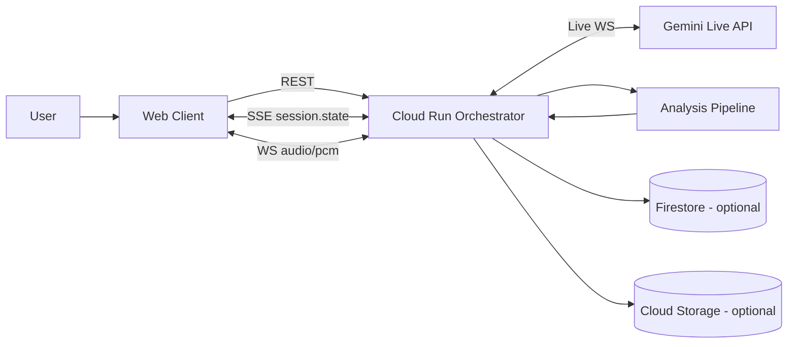

# oryn Architecture

Hackathon: Gemini Live Agent Challenge (Live Agents category)

oryn is a live co-reading agent that decomposes disagreements (factual/causal/definition/values/prediction) and produces an auditable “next 3 reads” choice set backed by evidence cards.

## What’s different

- Disagreement decomposition (not left/right labels)
- Choice-set optimization (3 deliberate next reads, not 30 links)
- Epistemic contract: no factual claims without evidence cards (URL-backed)
- Live co-reading: mic audio in, audio out, incremental transcript + artifacts

## High-level components

- Web Client (Next.js)
  - URL input + artifact UI (evidence cards, trace, map, choice set)
  - Mic capture (PCM) -> backend WebSocket

- Backend Orchestrator (Fastify on Cloud Run)
  - Session manager (REST)
  - Artifact streaming (SSE)
  - Live voice proxy (WS) to Gemini Live via Google GenAI SDK
  - Tooling pipeline (analysis -> evidence cards, clusters, choice set)

- Gemini Live API
  - Streaming ASR (input transcript), TTS audio output, output transcript
  - Tool calling (function tools) to trigger evidence-pack building

## Architecture diagram



## Runtime data flow

1) Web creates a session: `POST /v1/sessions`
2) Web opens SSE for state updates: `GET /v1/sessions/:id/events`
3) Web triggers analysis: `POST /v1/sessions/:id/analyze`
4) Backend publishes incremental session state over SSE
5) Web optionally starts Live voice: `WS /v1/sessions/:id/live`
   - Web streams `audio/pcm;rate=16000` chunks
   - Backend forwards audio to Gemini Live (`@google/genai`)
   - Backend streams back:
     - `audio.chunk` (PCM base64)
     - `transcript.chunk` (user + agent)
     - `session.state` snapshots
   - Gemini Live can request function tools; backend executes `oryn_get_evidence_pack` and replies via `sendToolResponse`

## API surface (current)

- Sessions
  - `POST /v1/sessions`
  - `GET /v1/sessions`
  - `GET /v1/sessions/:id`
  - `PUT /v1/sessions/:id/constraints`
  - `POST /v1/sessions/:id/analyze`
  - `GET /v1/sessions/:id/events` (SSE)

- Mutations
  - `POST /v1/sessions/:id/transcript`
  - `POST /v1/sessions/:id/cards/:cardId/pin`
  - `POST /v1/sessions/:id/choice-set/regenerate`

- Live voice
  - `GET /v1/sessions/:id/live` (WebSocket)

## Epistemic contract enforcement (current)

- UI is built around evidence cards + trace; backend pipeline always emits citations (or explicit fallbacks).
- Live system instruction embeds the contract: “Don’t state factual claims unless you can reference an evidence card id with a URL.”

## Repository layout

```text
/
  apps/
    web/                 # Next.js UI
    api/                 # Cloud Run service (orchestrator)
  packages/
    shared/              # types + protocol
  infra/
    cloudrun/            # deploy scripts
  docs/
    architecture.md
    demo_script.md
    threat_model.md
  README.md
```
